<h2 align="center"> TrackIt </h2>
This project is a complete habit tracking application! With the right to register, login and many libraries.

<h3>Description</h3>
This project has a login screen for the users that has a register:

 

  <a href="https://projeto11-trackit-nine-tan.vercel.app/">
    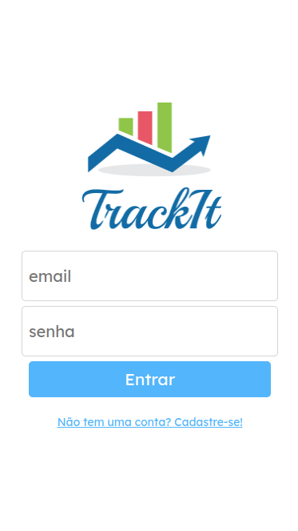
    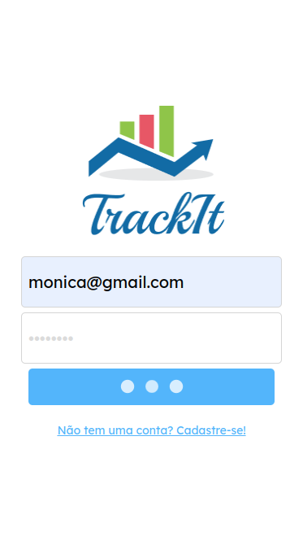
  </a>

 

A register screen for the ones that dosen't have a register yeat:

 

  <a href="https://projeto11-trackit-nine-tan.vercel.app/">
    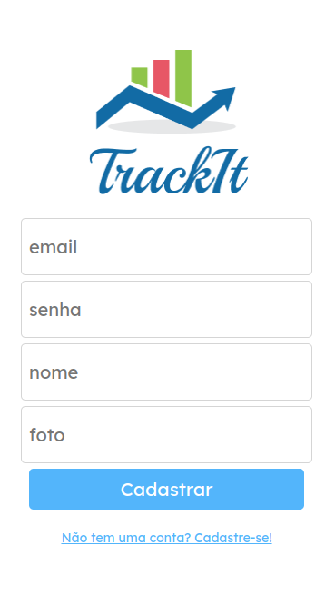
    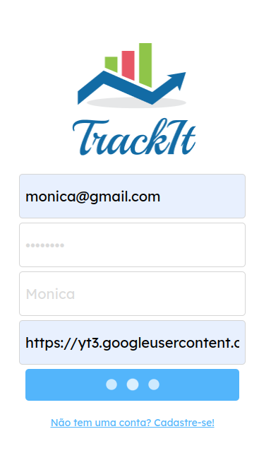
  </a>

 

A today page that shows when the user login:

 

  <a href="https://projeto11-trackit-nine-tan.vercel.app/">
    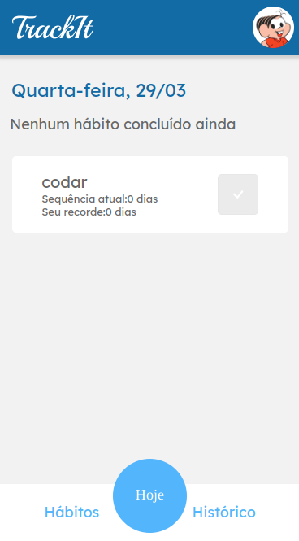
    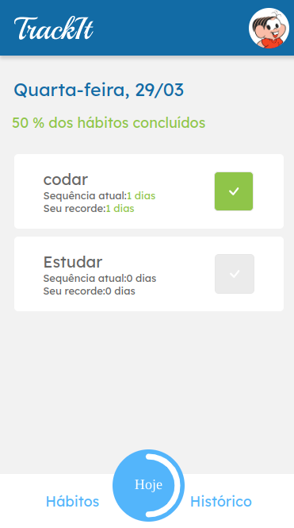
  </a>

 

A habit page to add and delete habits:

 

  <a href="https://projeto11-trackit-nine-tan.vercel.app/">
    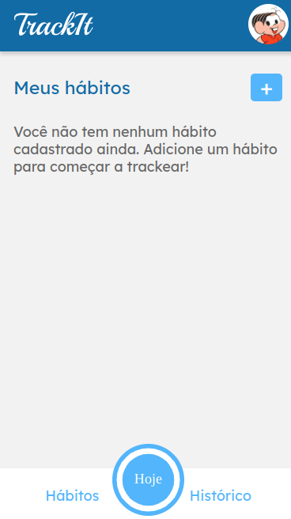
    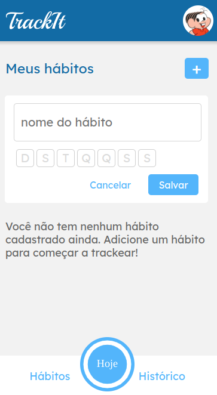
  </a>

 

  <a href="https://projeto11-trackit-nine-tan.vercel.app/">
    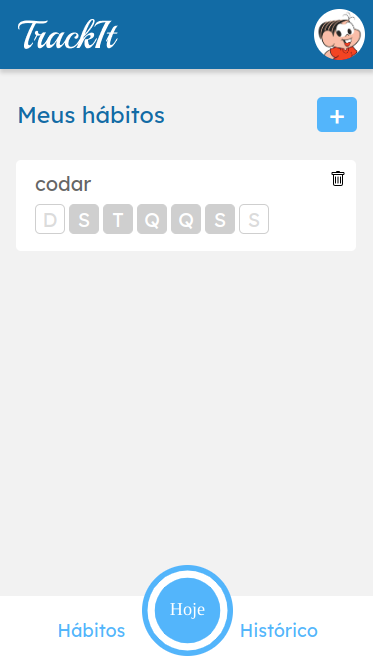
    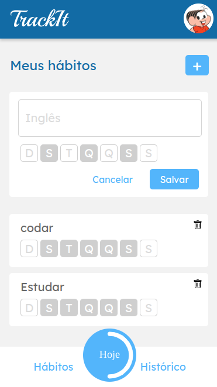
  </a>

 

A historic page that in the future will be updated with more features has a calendar with the habits track:

 

  <a href="https://projeto11-trackit-nine-tan.vercel.app/">
    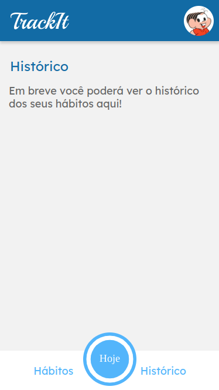
  </a>

